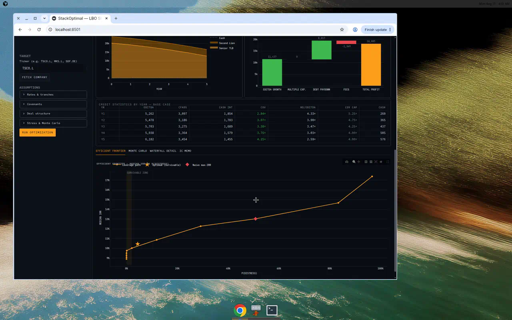
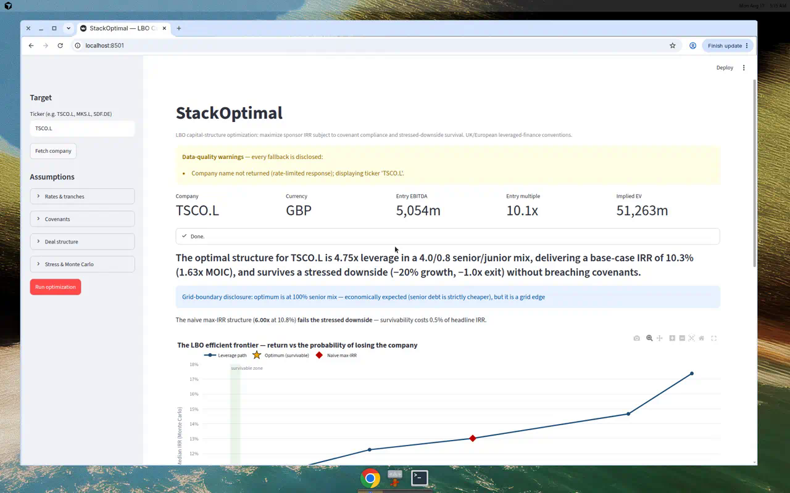

# StackOptimal — LBO Capital-Structure Optimizer


**StackOptimal searches the debt space to maximize sponsor IRR subject to
covenant and downside-survival constraints, outputting the risk-return
efficient frontier for any listed target.** Point it at any public company —
it pulls live fundamentals, scans the leverage × senior/junior-mix grid,
stress-tests every structure against a recession case, runs Monte Carlo risk
analysis, and writes the IC memo for you.

The headline insight it surfaces: **the gap between the naive max-IRR
structure and the survivable optimum.** Leverage you cannot survive is not
leverage you own.




> Screenshots captured from a live run on TSCO.L (see the case study below).
> To refresh them: `streamlit run app.py`, fetch a ticker, press **Run
> optimization**, and re-capture `docs/img/frontier.png` and
> `docs/img/dashboard.png`.

## Quickstart

```bash
# from the repo root, on the branch that contains the code
# (until PR #1 merges:  git fetch origin && git checkout cursor/stackoptimal-build-404b)
python3 -m pip install -r requirements.txt
python3 -m streamlit run app.py   # dashboard: fetch a ticker, press "Run optimization"
python3 -m pytest                 # 11 engine tests
python3 -m src.debt               # blended cost-of-debt convexity table
```

The `python3 -m …` form is deliberate: it works even when the `pytest` /
`streamlit` console scripts are not on your `PATH` and when `python` is not
aliased. On Windows, use `python` instead of `python3`.

### Troubleshooting

| Symptom | Cause | Fix |
|---|---|---|
| `command not found: python` | Only `python3` exists (Linux/macOS) | Use `python3 -m …` as above |
| `command not found: pytest` / `streamlit` | Console scripts installed to `~/.local/bin`, not on `PATH` | Use `python3 -m pytest` / `python3 -m streamlit …`, or `export PATH="$HOME/.local/bin:$PATH"` |
| `can't open file 'app.py'` / `No module named 'src'` | Not in the repo root | `cd` to the repository root first |
| `no tests ran` / file not found | You're on `main`; the code is on the PR branch | `git checkout cursor/stackoptimal-build-404b` (or merge the PR) |
| `externally-managed-environment` on pip install | PEP 668 system Python | Use a venv: `python3 -m venv .venv && source .venv/bin/activate`, then the commands above |

Requires Python 3.11+.

## Architecture

```
                 yfinance
                    │
                    ▼
            ┌───────────────┐     MarketAssumptions (rates, caps,
            │  src/inputs   │────▶ covenants, stress, MC params)
            │ fetch_company │
            └───────┬───────┘
                    │ CompanyData (EBITDA, growth, tax, warnings)
                    ▼
            ┌───────────────┐   sized stack   ┌──────────────┐
            │   src/debt    │───────────────▶ │  src/model   │  deterministic
            │  build_stack  │◀────────────────│   run_lbo    │  year-by-year
            └───────────────┘                 │  waterfall   │  engine
                    ▲                         └──────┬───────┘
                    │                                │ LBOResult
        leverage × mix grid                base + stress per point
                    │                                │
            ┌───────┴───────┐                       ▼
            │ src/optimizer │──────── OptimizationResult (optimum,
            │  grid search  │          naive max-IRR, full surface)
            └───────┬───────┘
                    │
        ┌───────────┼─────────────┐
        ▼           ▼             ▼
  ┌──────────┐ ┌─────────┐  ┌──────────┐
  │ src/risk │ │src/memo │  │  app.py  │
  │ Monte    │ │ IC memo │  │ Streamlit│
  │ Carlo +  │ │ markdown│  │ dashboard│
  │ frontier │ └─────────┘  └──────────┘
  └──────────┘
```

## Why grid search, not gradient methods

The debt waterfall makes the objective non-convex and path-dependent —
covenant tests kink the feasible region, tranche-cap boundaries kink the cost
of funds, and the cash sweep switches the mapping from this year's free cash
flow to next year's interest bill. Gradient methods on such a surface silently
converge to local optima and say nothing about the surrounding terrain. A
transparent grid scan finds the global optimum over the discretized space,
costs milliseconds per evaluation, and yields the full risk-return surface as
a free by-product.

## Worked case study — Tesco plc (TSCO.L)

Live fundamentals at build time: EBITDA £5,054m, revenue £73.7bn, market
EV/EBITDA 9.1x, 4.1% growth proxy, 25.4% effective tax rate. Entry at 10.1x
(market + 1.0x control premium) → EV £51.3bn.

| Structure | Leverage | Mix | Base IRR | MOIC | Survives stress? |
|---|---|---|---|---|---|
| **Survivable optimum** | **4.75x** | 100% senior | **10.3%** | **1.63x** | **Yes** |
| Naive max-IRR | 6.00x | 100% senior | 10.8% | 1.72x | **No** — coverage breach, year 1 |

The naive structure buys 0.5pp of headline IRR at the cost of failing its
interest-coverage covenant in the very first stressed year (1.85x vs the 2.0x
minimum). At the optimum, Monte Carlo (5,000 draws) gives median IRR 10.4%,
P5/P95 of 2.5%/18.3%, and P(distress) of 4.4%. Value creation of £18.1bn
decomposes into £11.4bn EBITDA growth + £8.0bn debt paydown + £0 multiple
expansion − £1.4bn fees — returns earned the honest way.

*(Figures move with live market data; re-run the app for the current answer.)*

## Assumptions & sources

Defaults reflect the European leveraged-finance market as of mid-2026 and are
chosen to be defensible against **free public sources**: Bank of England Bank
Rate data (SONIA proxy 3.75%), S&P Global leveraged-finance commentary on
post-2022 leverage norms (senior capacity ~4.0x, total ~7.0x), and listed
direct-lender disclosures for junior pricing (second lien ~S+650, mezzanine
~12% cash-pay). Paid loan-market data (PitchBook LCD) was **deliberately not
used** — every assumption is adjustable in the sidebar, and every fetched
fundamental that falls back to an assumption is disclosed in the warnings
panel. No silent substitutions.

## Limitations

No revolver (a cash shortfall is immediately fatal), no PIK interest, D&A =
capex (steady state), no dividend recaps (the IRR solver is already
recap-ready), single currency, no tax-loss carry-forwards, and public-filings
data only. Each simplification ships with a one-line "how I'd extend it" in
[docs/WALKTHROUGH.md](docs/WALKTHROUGH.md), which also explains every
mechanism — sources & uses, waterfall path dependence, covenant mechanics,
the value-creation bridge — in interview-ready prose.

## Repo layout

```
src/inputs.py     data fetch (yfinance) + documented market assumptions
src/debt.py       tranche objects + cheapest-first stack builder
src/model.py      deterministic LBO engine (the core)
src/optimizer.py  grid search + naive-vs-survivable gap
src/risk.py       Monte Carlo + efficient frontier
src/memo.py       IC memo generator
app.py            Streamlit dashboard
tests/            pytest suite (11 tests, fully offline)
docs/             WALKTHROUGH.md + memo template
```

## License

MIT — see [LICENSE](LICENSE).
