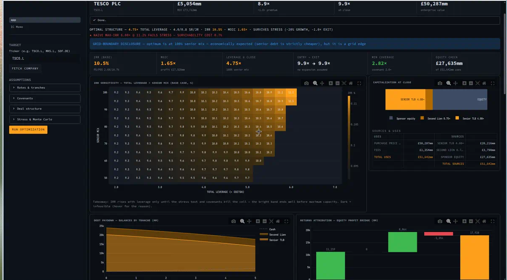
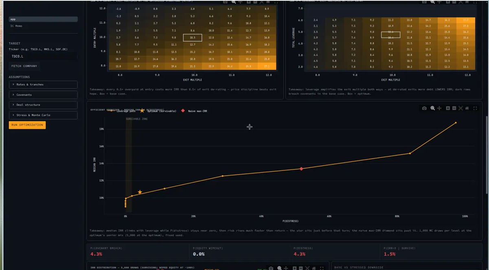

# StackOptimal — LBO Capital-Structure Optimizer


**In plain English:** when a private-equity firm buys a company, it borrows most of
the money. This tool answers the obvious follow-up — *how much* should it borrow,
and in what mix of cheap vs. expensive debt, to earn the best return without losing
the company in a recession? It works on any listed company: type a ticker, get an
answer.

**Technically:** an optimizer that searches over LBO capital structures — how much
debt, in which tranches — to maximize the private-equity sponsor's return (IRR),
subject to the constraints that actually kill deals: leverage limits,
interest-coverage and leverage covenants, and survival of a stressed downside. Live
fundamentals come from Yahoo Finance; outputs include the optimal debt stack, the
full risk-return frontier, and a draft investment-committee memo.



*The deal tearsheet for Tesco plc: recommended structure and key return metrics up
top, the optimizer's IRR grid as the main panel, then capital structure, debt
paydown, and where the profit comes from.*

The app boots on a bundled snapshot of Tesco plc fundamentals (captured 20 Aug
2026, source and vintage shown in the app) so the demo needs no network; press
**Fetch company** to refresh live or load any other ticker. The engine itself is
validated line-by-line against a fully hand-computed LBO schedule — see
[docs/VALIDATION.md](docs/VALIDATION.md) — and that reconciliation is pinned in CI.

## Why this exists

PE returns are usually explained as "buy well, improve the business, sell well" —
with the debt structure treated as an afterthought. But the structure is a design
choice with its own effect on returns: each extra turn of leverage raises IRR
mechanically, right up to the point where covenants or a bad year hand the company
to the lenders. I wanted to measure how much of the difference between a good deal
and a failed one is decided by the financing, before operations enter the picture.

So I built a tool to test it. Give it a ticker and it searches the leverage ×
tranche-mix space, runs each structure through a year-by-year debt model,
stress-tests it against a recession case, and shows the gap between the structure
with the highest headline IRR and the structure that survives. That gap is usually
smaller than people expect — and occasionally it is the difference between keeping
the company and losing it.

## What it does

The pipeline mirrors how a deal team actually builds an LBO:

1. **Transaction assumptions** — entry at the market EV/EBITDA plus a control
   premium, fees capitalized into uses, 5-year hold, exit at entry multiple (no
   multiple expansion underwritten).
2. **Sources & uses** — the equity cheque is the plug: EV + fees − debt raised.
3. **Multi-tranche debt** — senior TLB (SONIA + 350, capped at 4.0×), second lien
   (+650, +1.5×), mezzanine (12% fixed cash-pay, +1.5×), filled cheapest-first,
   exactly as an arranger would place it, plus a 0.5× *revolver* (undrawn at
   close, S+300 drawn, 50bp commitment fee) as the liquidity backstop. *PIK*
   ("payment in kind" — interest that accrues to the balance instead of being
   paid in cash) is a documented extension; the mezzanine here is cash-pay.
4. **Cash-sweep waterfall** — each year: cash interest on opening balances →
   mandatory amortization → shortfalls covered by cash then a revolver draw →
   revolver repaid first from surplus → *cash sweep* (75% of the year's excess
   cash flow prepays term debt, senior-first) → the retained 25% builds
   balance-sheet cash.
5. **FCF projection** — EBITDA growth, capex, cash taxes (interest and
   financing-fee amortization are deductible), working-capital drag, with
   covenant tests every year: *interest coverage* (EBITDA ÷ cash interest ≥
   2.0×) and a stepped net-leverage covenant.
6. **Exit returns** — IRR and *MOIC* (multiple on invested capital: exit equity ÷
   entry equity) on the full cash-flow vector.
7. **Attribution bridge** — equity profit decomposed exactly into EBITDA growth,
   multiple expansion, and debt paydown, so you can see whether a deal earns its
   return or just bets on the multiple.
8. **Constrained optimization + Monte Carlo** — the optimum across the grid, the
   naive max-IRR structure for contrast, and 5,000-draw risk analysis (growth,
   exit multiple, base-rate path) powering the efficient frontier.

The dashboard is a single scrollable **deal tearsheet** (metric strip, IRR heatmap,
cap stack, paydown, attribution, credit grid, frontier, Monte Carlo, waterfall);
the generated IC memo lives on its own page (sidebar navigation) with a markdown
download.

## How the optimizer works

**Objective:** maximize base-case IRR. **Decision space:** total leverage (2.0× →
market capacity, 0.25× steps) × senior mix (50–100%, 5pp steps). **Constraints:** a
structure is admissible only if it is covenant-compliant in every year of the base
case *and* survives the stressed downside (−20% growth, a one-off −10% EBITDA shock,
−1.0× exit multiple) with the equity intact.

**Search method — grid scan, deliberately.** The debt waterfall makes the objective
non-convex and path-dependent: covenants cut whole regions out of the feasible set,
tranche caps make each additional turn of debt more expensive than the last, and the
cash sweep means this year's paydown changes next year's interest bill. Gradient
methods on a surface like that can settle on local optima and say nothing about the
rest of the space. A grid scan finds the global optimum over the discretized space,
costs milliseconds per evaluation, and produces the full risk-return surface as a
by-product.

**Honest limitations of the approach:** the grid discretizes a continuous space, so
the true optimum can sit between grid points (the tool flags boundary optima rather
than hiding them); the stress case is one deterministic scenario, not a statement
about all recessions; and IRR-maximization subject to survival is a sponsor's
objective — a lender or an LP would weight the constraints differently.



*The two tables an IC stress-reads: IRR across entry × exit multiple at the
optimized structure (price discipline beats exit hope), and IRR across leverage ×
exit multiple (at de-rated exits, more debt LOWERS the return). Dark cells breach
a covenant; the white box marks the base case.*

## Example result — Tesco plc (TSCO.L)

Fundamentals snapshot (20 Aug 2026): EBITDA £5,054mm, revenue £73.7bn, market
EV/EBITDA 8.9×. Entry at 9.9× (market + 1.0× premium) → EV £50,287mm.

| Structure | Leverage | Mix | Base IRR | MOIC | Survives stress? |
|---|---|---|---|---|---|
| **Optimum (survivable)** | **4.75×** | 100% senior | **10.5%** | **1.65×** | **Yes** |
| Naive max-IRR | 6.00× | 100% senior | 11.2% | 1.70× | **No** — coverage breach, year 1 |

The comparison is the point of the tool: unconstrained IRR-maximization picks 6.00×
and breaches its interest-coverage covenant in the first stressed year (1.84× vs the
2.0× minimum). The survivable optimum gives up **0.7pp of IRR** to avoid that. At
the optimum: Monte Carlo median IRR 10.7% (P5/P95 2.6%/18.7%), P(distress) 4.3%, and
the £17.9bn equity profit decomposes into £11.2bn EBITDA growth + £8.1bn debt
paydown + £0 multiple expansion − £1.4bn fees. The full write-up is in
[docs/DEAL_MEMO.md](docs/DEAL_MEMO.md).

*(Figures come from the bundled snapshot; fetching live data will move them.)*


*The efficient frontier: median IRR against probability of distress as leverage
rises. Star = the recommended structure; diamond = the highest-IRR structure, which
fails the downside test.*

## Skills this demonstrates

- **Software engineering** — typed, modular Python (dataclasses, numpy, pandas);
  16-test pytest suite including a to-the-penny reconciliation against a
  hand-computed schedule; GitHub Actions CI; pinned, reproducible dependencies.
- **Financial modelling** — sources & uses, a multi-tranche debt waterfall with
  cash sweep, covenant testing, IRR/MOIC, and a value-creation bridge, built
  year-by-year the way a deal team's Excel model works.
- **Data work** — live fundamentals from a free API (yfinance), with every
  fallback and assumption disclosed rather than silently substituted.
- **Quantitative risk** — seeded Monte Carlo over growth, exit multiple, and
  interest rates; results read as probabilities, not point estimates.
- **Communication** — the app writes a draft IC memo from its own outputs; the
  full mechanism write-up is in [docs/WALKTHROUGH.md](docs/WALKTHROUGH.md).

## Quickstart

```bash
git clone https://github.com/diegoevrard07-cyber/LBO-Capital-Structure-Optimization.git
cd LBO-Capital-Structure-Optimization
python3 -m venv .venv && source .venv/bin/activate
pip install -r requirements.txt
streamlit run app.py
```

The app boots on the bundled Tesco (`TSCO.L`) snapshot — just press
**Run optimization**; the full grid scan + Monte Carlo + frontier takes ~20–30
seconds, no network required. **Fetch company** loads live data for any ticker.
Tests: `pytest` (16 engine tests, fully offline).
Convexity demo: `python -m src.debt`. Requires Python 3.11+.

If your shell can't find `pytest`/`streamlit` outside the venv, use the
`python3 -m …` forms (`python3 -m streamlit run app.py`, `python3 -m pytest`) — they
work regardless of `PATH`. If charts show a deprecation banner about "keyword
arguments", your Streamlit is old — almost always because `python3` is older than
3.11 (check with `python3 --version`); install a newer Python (`brew install
python@3.12`), recreate the venv, and reinstall.

## Design decisions I'd defend in an interview

- **Simulation over closed form** — the waterfall is path-dependent (this year's
  sweep sets next year's interest, hence taxes, hence next year's sweep), so the
  engine computes year by year, like the Excel model it would be audited against.
- **Grid search over gradients** — covenant kinks and tranche-cap boundaries make
  the surface non-convex; the grid is global, transparent, and the frontier falls
  out for free.
- **Admissibility = base feasibility AND stress survival** — the naive max-IRR
  structure is reported separately, so the price of survivability is always visible.
- **Every data fallback is disclosed in the UI** — public-filings data is noisy;
  silently substituting an assumption would be intellectually dishonest.
- **Fixed Monte Carlo seeds** — a research tool must return identical numbers
  run-to-run, or its outputs can't be cited.

## Limitations & roadmap

- **Annual granularity** — the revolver bridges year-level shortfalls; intra-year
  working-capital swings need quarterly periods.
- **No interest income on cash** — retained cash reduces net debt but earns
  nothing (mildly conservative).
- **No PIK interest** — mezzanine is cash-pay; extension: a `pik_fraction` per
  tranche, accruing to the balance and excluded from cash coverage.
- **D&A = capex** (steady state) — extension: a depreciation schedule with lags for
  lumpy capex businesses.
- **No dividend recaps** — the IRR solver already handles multiple sign changes;
  extension: an optional year-3 relever into the cash-flow vector.
- **Single currency, no tax-loss carry-forwards** — both bounded, documented
  simplifications.
- **Public data only** — paid loan-market data (PitchBook LCD) deliberately unused;
  defaults are chosen to be defensible against free public sources (Bank of England
  rate data, S&P Global leveraged-finance commentary, listed direct-lender
  disclosures).

The full mechanism-by-mechanism write-up — waterfall mechanics, covenant practice,
the value-creation bridge, every default's justification, and the ten hardest
questions a banker would ask (with answers) — is in
[docs/WALKTHROUGH.md](docs/WALKTHROUGH.md). The hand-worked engine validation is in
[docs/VALIDATION.md](docs/VALIDATION.md); the sample deal memo in
[docs/DEAL_MEMO.md](docs/DEAL_MEMO.md); the IC memo structure the app generates in
[docs/memo_template.md](docs/memo_template.md).

## Repo layout

```
src/inputs.py     data fetch (yfinance) + documented market assumptions
src/debt.py       tranche objects + cheapest-first stack builder
src/model.py      deterministic LBO engine (the core)
src/optimizer.py  grid search + naive-vs-survivable gap
src/risk.py       Monte Carlo + efficient frontier
src/memo.py       IC memo generator
app.py            terminal-styled Streamlit dashboard (single-page tearsheet)
pages/            IC memo page (sidebar navigation)
tests/            pytest suite (16 tests, fully offline, incl. hand-worked reconciliation)
docs/             WALKTHROUGH.md, VALIDATION.md, DEAL_MEMO.md, memo template, screenshots
```

## Disclaimer

Personal, educational project. Not investment advice, not an offer, and not a
substitute for a real diligence process. Market data via Yahoo Finance; financing
assumptions are illustrative defaults, adjustable in the UI.

## License

MIT — see [LICENSE](LICENSE).
